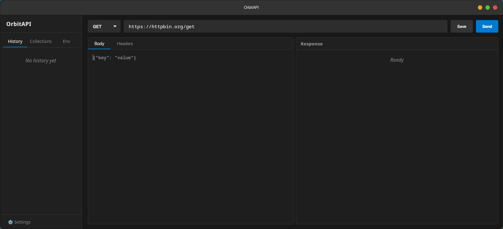
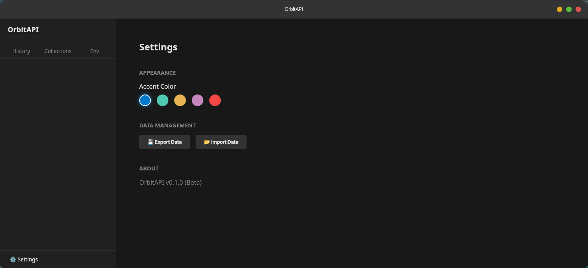

# 🚀 OrbitAPI

<div align="center">

**A lightweight, blazing-fast HTTP Client built with Rust & React.**
<br />
Alternative to Postman/Insomnia, designed for performance, simplicity, and local privacy.


</div>

---

## 📖 Overview

OrbitAPI is a native desktop application for testing RESTful APIs. By leveraging **Tauri**, it uses a lightweight **Rust** backend to execute actual HTTP requests (bypassing browser CORS limitations and ensuring low latency), coupled with a modern, responsive **React** user interface.

It runs entirely locally—no cloud accounts, no data syncing, just you and your APIs.

<br />



<br />

## ✨ Key Features & UI Showcase

### ⚡ High-Performance Request Builder

Craft requests effortlessly. The Rust backend ensures your requests are sent instantly without browser overhead.

* **Native Execution:** Requests are handled by Rust's `reqwest`, not the browser's fetch API.
* **Method Support:** Full support for GET, POST, PUT, DELETE, and PATCH.
* **Body Editor:** Clean JSON editor for request payloads.
* **Real-time Metrics:** Instantly view status codes, response times (ms), and response sizes.

### 📂 Workspace Organization (History & Collections)

Keep your workflow tidy. Don't lose track of that one endpoint you tested yesterday.

* **Automatic History:** Every request sent is saved to a searchable history list.
* **Collections:** Group related requests into named folders.
* **Quick Save:** Easily save interesting requests from history directly into a collection.
* **Drag & Drop Resizing:** Customize the width of your sidebar and request/response panes to fit your screen.

### 🎨 Personalization & Data Management

Make it yours and keep your data safe.

* **Dark Mode Default:** Easy on the eyes for late-night coding sessions.
* **Accent Themes:** Choose from 5 distinct accent colors (Blue, Green, Orange, Purple, Red) in the settings.
* **Portable Data:** Full Import/Export capability. Backup your entire workspace (Collections and History) to a single JSON file.

<div align="center">
  
</div>

---

## 🛠️ Tech Stack

| Layer | Technology | Purpose |
| :--- | :--- | :--- |
| **Core Host** | [Tauri](https://tauri.app/) | Native windowing and security sandbox |
| **Backend Logic** | [Rust](https://www.rust-lang.org/) | HTTP networking (via `reqwest`) and file handling |
| **Frontend UI** | React + TypeScript | User interface components and state management |
| **Bundler** | Vite | Fast frontend tooling |
| **Styling** | CSS Variables | Custom theming engine |

## 🚀 Getting Started

### Prerequisites

Ensure you have the following installed:
1.  **Node.js** (LTS version recommended)
2.  **Rust** & Cargo (via [rustup.rs](https://rustup.rs/))
3.  **OS Build Tools** (Xcode for macOS, C++ Build Tools for Windows, etc. - see Tauri docs).

### Installation & Running

1.  **Clone the repository**
    ```bash
    git clone https://github.com/Shabari-K-S/OrbitAPI.git
    cd orbitapi
    ```

2.  **Install dependencies**
    ```bash
    npm install
    ```

3.  **Run in development mode**
    ```bash
    npm run tauri dev
    ```

### Building for Production

To create an optimized native executable for your current OS:

```bash
npm run tauri build

```

## 🤝 Contributing

Contributions are welcome! Feel free to open an issue to discuss proposed changes or submit a Pull Request.

---

<div align="center">
<sub>Built with ❤️ by Shabari using Tauri</sub>
</div>
